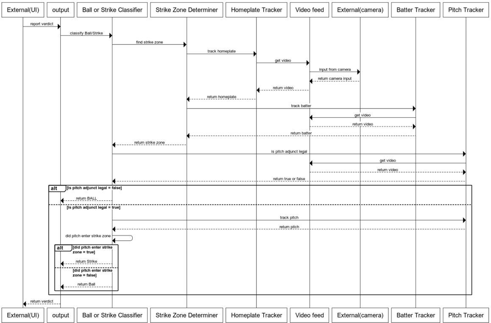
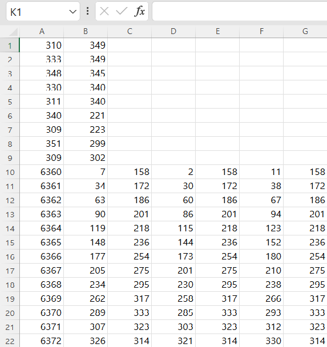
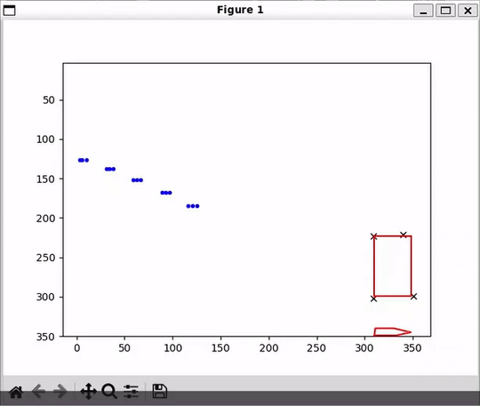
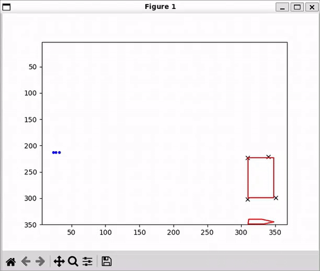
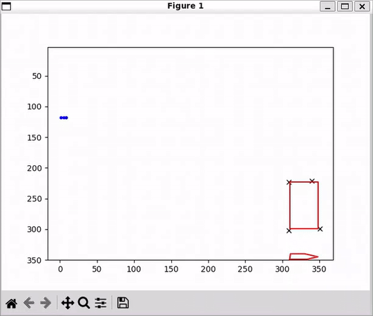
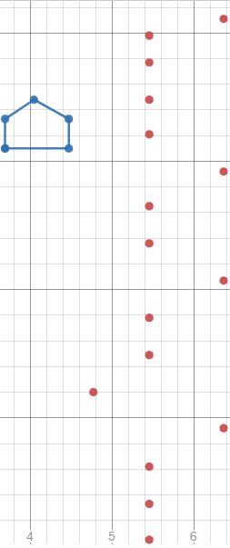
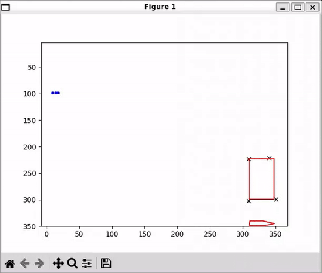

# SLOW_ARC_System
## Team Members: Jun Yeol Ryoo(ryoo0005), Vaagishwaran Sivakumar(sivak049), Lukas Spooner(spoon057), Muhtasim Fuad Jeet(jeet0001), Lam Duong

## Overview:
This project implemented the **Slow-Pitch Automated Review Calculation (SLOW-ARC)** system, designed to determine whether a specific pitch crosses through the strike zone in a Slow-pitch softball game. Using pitch data files containing coordinates of pitch, player, and home plate, captured from a side view, our system delivers accurate verdicts.

## Key Features:
1) **Automated Verdicts:** The system automatically determines whether a pitch crosses through the strike zone.
2) **Pitch Data Analysis:** Utilizing pitch data files with precise coordinates, the system performs in-depth analysis of pitch tracks and player positions.
3) **Objective Assessment:** By removing subjective judgment, the system enables objective and fair judgment in game review processes.

**SLOW-ARC Sequence Diagram:**


**Pitch Data File Format:**<br>
<br>
The first five lines are the coordinates of the five points of the plate, moving from front-left corner counter-clockwise. The next four lines capture the coordinates of both shoulders and both knees of the batter. The remaining lines give the actual pitch data: a timestamp, coordinates for the center of the ball, and then coordinates for both the left and right sides of the ball through the center.

## How to run the program
Before running this program, please ensure that you have the following dependencies installed:<br>
**matplotlibcpp:** This program relies on the matplotlib C++ library. You can install it by following the instructions provided in [here](https://github.com/lava/matplotlib-cpp)
```
# Navigate to the project directory 
cd /path/to/repo/project

# Build the project (simply type "make")
make
 
# Run the project
./main <data_directory>  ## Data_directory is a directory that contains all pitch files
```

## Usage
Ball (did not pass through the strike zone):<br>


Ball (short pitch):<br>


Ball (see front view image):<br>
<br>
Front view image:<br>


Strike:<br>

